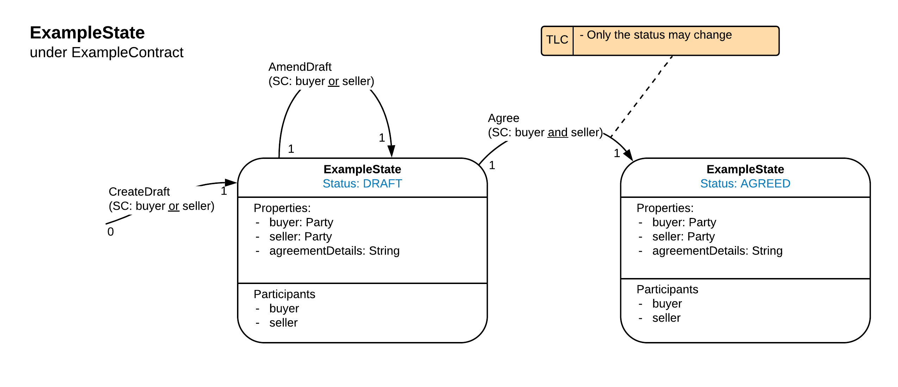

<p align="center">
  
</p>

# CorDapp Client Template - Kotlin

Welcome to the Kotlin CorDapp template. The CorDapp template is a stubbed-out CorDapp that you can use to bootstrap your own CorDapps. It also contains an example implementation of some simple Cordapp components that you may find helpful.

# Pre-Requisites

See https://docs.corda.net/getting-set-up.html.

# Usage

## Running the nodes

See https://docs.corda.net/tutorial-cordapp.html#running-the-example-cordapp.

This can be done by the network bootstrapper method simply by running the two scripts in the `script` folder. You might need to changed the file permissions first to do so. 

    cd scripts
    chmod +x deployNodes.sh runNodes.sh 
    ./deployNodes.sh 
    ./runNodes.sh

## Interacting with the nodes

### Shell

When started via the command line, each node will display an interactive shell:

    Welcome to the Corda interactive shell.
    Useful commands include 'help' to see what is available, and 'bye' to shut down the node.
    
    Tue Nov 06 11:58:13 GMT 2018>>>

You can use this shell to interact with your node. For example, enter `run networkMapSnapshot` to see a list of 
the other nodes on the network:

    Tue Nov 06 11:58:13 GMT 2018>>> run networkMapSnapshot
    [
      {
      "addresses" : [ "localhost:10002" ],
      "legalIdentitiesAndCerts" : [ "O=Notary, L=London, C=GB" ],
      "platformVersion" : 3,
      "serial" : 1541505484825
    },
      {
      "addresses" : [ "localhost:10005" ],
      "legalIdentitiesAndCerts" : [ "O=PartyA, L=London, C=GB" ],
      "platformVersion" : 3,
      "serial" : 1541505382560
    },
      {
      "addresses" : [ "localhost:10008" ],
      "legalIdentitiesAndCerts" : [ "O=PartyB, L=New York, C=US" ],
      "platformVersion" : 3,
      "serial" : 1541505384742
    }
    ]
    
    Tue Nov 06 12:30:11 GMT 2018>>> 

You can find out more about the node shell [here](https://docs.corda.net/shell.html).

### Client Webserver

`clients/src/main/kotlin/com/template/webserver/` defines a simple Spring web server that connects to a node via RPC and 
allows you to interact with the node over HTTP. This connection is established via a proxy `NodeRPCConnection.kt` class.

Some helpful starter API endpoints are defined here:

     clients/src/main/kotlin/com/template/webserver/StandardController.kt
     
You can add and extend your own here:

     clients/src/main/kotlin/com/template/webserver/CustomController.kt


#### Running the webserver

##### Via the command line

Each node has it's own corresponding Spring server that interacts with it via Node RPC Connection proxy which is essentially a wrapper around the CordaRPCClient class. You can start these web servers via gradle tasks for ease-of-development. 

    ./gradlew runPartyAServer 
    ./gradlew runPartyBServer
    ./gradlew runPartyCServer  
    
These web servers are hosted on ports 50005, 50006 and 50007 respectively. You can test they have launched successfully by connecting to one of there endpoints.

    curl localhost:50005/api/status -> 200
    
The list of available endpoints to play with now are:
    
    /api/servertime
    /api/addresses
    /api/identities
    /api/platformversion
    /api/peers
    /api/notaries
    /api/flows/
    /api/states
    
You can add your own custom endpoints to the Spring Custom Controller, or any other controller of your choosing.
    
### Run a local Docker network

You can interact with the Corda nodes on your own mini network of docker containers. You can bootstrap this network via the `docker.sh` script within docker module. This script will create containers according to how many names you specifiy in the participant.txt file. 
The script starts by spinning up a docker network. Each container that is generated is added to the docker network `mininet`. Furthermore each Corda node in those containers joins the local Corda network by requesting access through the `netmap` container which contains:
 1. An identity operator (previously doorman service) 
 2. A Network Map Service
 3. A Notary
 
Once the script has been successfully ran you can inspect the docker processes. via the command below which should display a list of 4 running containers; one for each of the 3 partys and one for the notary and network map service.

    docker ps

Alternatively you can display all docker containers whether they are running or not via the command 

    docker ps -a
    
Once you can see the running containers. You can `ssh` in to one to interact with the corda node via the command

    ssh rpcUser@localhost -p <ssh-port> #2221 is the first port used. The password is testingPassword
    
The template uses the Corda finance Cordapps but you can use any of your own. Just place them in the Cordapps folders by editing the script or do it after and relaunch the container. We can test this node is successfully running by running

    run vaultQuery contractStateType: net.corda.finance.contracts.asset.Cash$State
    start net.corda.finance.flows.CashIssueFlow amount: $111111, issuerBankPartyRef: 0x01, notary: Notary
    start net.corda.finance.flows.CashPaymentFlow amount: $500, recipient: "Party2"
    start net.corda.finance.flows.CashPaymentFlow amount: $500, recipient: "Party3"
    
Try other nodes too

    ssh rpcUser@localhost -p 2222
    start net.corda.finance.flows.CashPaymentFlow amount: $200, recipient: "Party1"
    start net.corda.finance.flows.CashPaymentFlow amount: $100, recipient: "Party3"

### Deploy a Kubernetes network of Corda nodes

You can deploy a collection of Corda nodes within docker containers on a kubernetes cluster on your machine. Each node currently runs the [Yo Cordapp](https://github.com/corda/samples/tree/release-V4/yo-cordapp) but work is underway to link up the output of workflows and contracts build jars of this template. 

The essential commands are:

**Remove any existing yo-app stacks.**
```
docker stack rm yo-app --orchestrator=kubernetes
```

**Compiles the Docker images from the sub folders**

For windows:
```
docker build .\party-a\. -t party-a
docker build .\party-b\. -t party-b
docker build .\party-c\. -t party-c
```

For mac:
```
docker build ./party-a/. -t party-a
docker build ./party-b/. -t party-b
docker build ./party-c/. -t party-c
```

**Deploy the stack**

for windows:
```
docker stack deploy yo-app --compose-file .\docker-compose.yml --orchestrator=kubernetes
```
for mac:
```
docker stack deploy yo-app --compose-file ./docker-compose.yml --orchestrator=kubernetes
```

After it has been deployed, use this command to check that it is up and running:
```
docker stack ps yo-app --orchestrator=kubernetes
```

From the above command you can also get the containers id and feed it into this command to view the output:
```
docker service logs -f <CONTAINER-ID>
```

The nodes also have SSH access to the Crash shell, which allows you to execute any flows directly on the nodes.
It may take a minute or so for the network to start up, once it does the Corda nodes be accessed via ssh with username: **user1** and password: **test**, with the following command:

```
ssh -o StrictHostKeyChecking=no user1@localhost -o UserKnownHostsFile=/dev/null -p 2221
```
Please note that the depending on which port number you select, you will connect to *party-a(2221)*, *party-b(2222)* or *party-c(2223)*.


Once in the Node Shell, you can initiate a YO Flow by running the following command:
```
flow start YoFlow target: [NODE_NAME], for example *PartyB*
```
Please note that the names of the parties are *PartyA*, *PartyB* and *PartyC*, these are the Nodes X500 names and should not be confused with the directory names which are all lower case.

At this point you may consider logging in to another Node and sending a Yo to PartyA as well.

In order to inspect if you have received a Yo from another Node, you can execute the following command:
```
run vaultQuery contractStateType: net.corda.yo.YoState
```
## H2 Database

To install H2 db in your Corda node follow the [instruction here](https://docs.corda.net/head/node-database-access-h2.html?highlight=database#connecting-using-the-h2-console
)

Corda no longer gives you a jdbc port to connect an H2 client to by default. However, it is possible to configure the set up to do this by changing the node.config directly by [follow these instructions](https://docs.corda.net/head/node-database-access-h2.html?highlight=database#connecting-via-a-socket-on-a-running-node
)

However this is a bit clumsy as deployNodes will overwrite the config each time you deployNode. To get deployNodes to generate the correct node.config, [follow these instructions](https://docs.corda.net/head/generating-a-node.html?highlight=create%20nodes%20locally#the-cordform-task
)

The extra piece of configuration you need is: 

            extraConfig = [
                // Setting the H2 address.
                h2Settings: [ address: 'localhost:10030' ]
            ]

  
# Extending the template

You should extend this template as follows:

* Add your own state and contract definitions under `contracts/src/main/kotlin/`
* Add your own flow definitions under `workflows/src/main/kotlin/`
* Extend or replace the client and webserver under `clients/src/main/kotlin/`

For a guided example of how to extend this template, see the Hello, World! tutorial 
[here](https://docs.corda.net/hello-world-introduction.html).


# Examples

This template includes the following: 

ExampleState and ExampleContract: A Simple Contract-State pair which defines the following StateMachine: 

 


ExampleContractTests: Non exhaustive Examples of ContractTests which test the above state machine.

ExampleFlows: Flows to create, amend and Agree the ExampleStates.

ExampleFlowTests: Non exhaustive test to test the above flows.

ExampleDriverBasedTests: Non exhaustive integration tests.